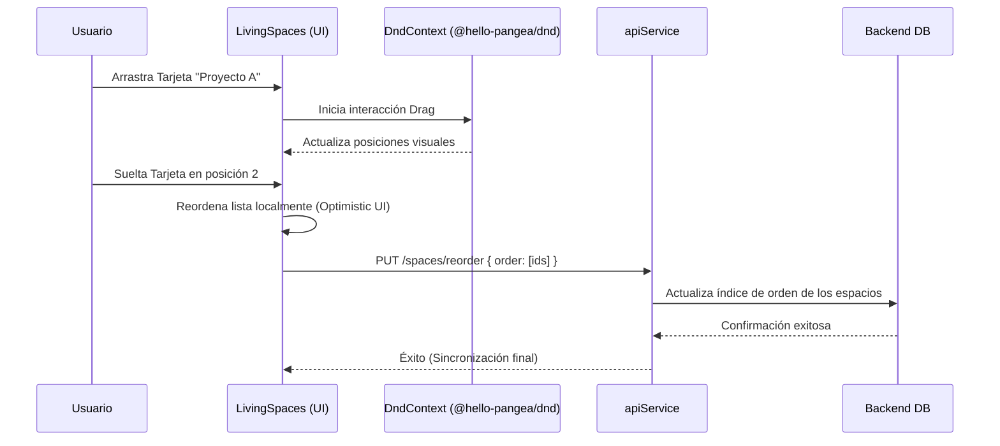

# Spec-Driven Development: Propuesta de Cambio (Proposal)
## Cambio: living-spaces-integration

**Estado**: PROPUESTO (PROPOSED)
**Fecha**: 2026-06-02
**Autor**: Antigravity (AI Senior Architect)

---

### 1. Intención del Cambio (Intent)

El objetivo central de esta propuesta es unificar e integrar de extremo a extremo el panel de **Espacios Vivos (Living Spaces)** en el perfil de usuario de Lumora. Esto comprende dos hitos de alta interactividad y funcionalidad:

1. **Creación de Espacios Vinculados a la Faceta Activa:**
   * Conectar la tarjeta dashed estática de *"Crear nuevo Espacio"* del perfil para que abra de forma interactiva el modal `CreateSpaceModal`.
   * Modificar el flujo de envío del formulario para que el nuevo espacio se asocie de forma estricta a la faceta activa del usuario, asegurando la consistencia relacional en la base de datos.

2. **Reorganización Interactiva mediante Drag-and-Drop (DND):**
   * Integrar la capacidad de reordenar físicamente los espacios vivos en la cuadrícula del perfil mediante gestos interactivos de arrastrar y soltar utilizando la librería `@hello-pangea/dnd`.
   * Guardar y persistir el orden personalizado en la base de datos para que la visualización del perfil mantenga exactamente la secuencia deseada por el usuario.

---

### 2. Auditoría del Estado Actual y Elementos Faltantes (Code Audit & Gap Analysis)

Tras auditar detalladamente la base de código del frontend, se identificaron los siguientes puntos de intervención y carencias:

#### A. Tarjeta de Creación de Espacio Estática
* **Ubicación**: [`components/profile/living-spaces.tsx`](file:///Users/albertovazquez/Documents/lumora-project/lumora-frontend/components/profile/living-spaces.tsx#L120-L129)
* **Estado Actual**: Es un renderizado visual estático (`Card` dashed) que carece de manejadores de eventos.
* **Lo que falta**: Agregar un callback `onCreateSpace` o un disparador interactivo que abra el `CreateSpaceModal`, pasando el `facetId` activo para vincular el espacio recién creado.

#### B. Falta de Soporte e Integración Drag-and-Drop
* **Ubicación**: [`components/profile/living-spaces.tsx`](file:///Users/albertovazquez/Documents/lumora-project/lumora-frontend/components/profile/living-spaces.tsx#L48-L50)
* **Estado Actual**: El botón *"Arrastra para reorganizar tus espacios"* es de solo lectura y la lista de espacios se mapea en una cuadrícula CSS tradicional de una sola vía.
* **Lo que falta**:
  * Configurar e integrar el contenedor del listado de espacios dentro de los componentes drag-and-drop (`DragDropContext`, `Droppable`, `Draggable`) de `@hello-pangea/dnd`.
  * Habilitar un disparador visual y soporte en dispositivos móviles (touch handlers).
  * Crear un callback `onReorder` en la página principal del perfil para guardar el estado del nuevo orden.

#### C. Persistencia del Orden y Faceta en la API
* **Ubicación**: [`lib/api.ts`](file:///Users/albertovazquez/Documents/lumora-project/lumora-frontend/lib/api.ts) y [`hooks/useSpaces.ts`].
* **Estado Actual**: `apiService.createSpace` crea espacios generales pero no asocia explícitamente el `facetId` en todas las llamadas, y no existe un método para persistir el orden secuencial de los espacios del usuario.
* **Lo que falta**:
  * Modificar `createSpace` para que acepte opcionalmente un `facetId` en el cuerpo de la petición.
  * Añadir un método `apiService.updateSpacesOrder(spacesOrderData)` o almacenar el orden secuencial en las preferencias de la faceta / usuario.

---

### 3. Alcance de la Implementación (Scope)

El alcance se estructurará en tres fases de desarrollo ágil:

#### **Fase 1: Creación de Espacios Vinculados a Facetas**
* Conectar el disparador `onClick` en la tarjeta de creación de [`components/profile/living-spaces.tsx`](file:///Users/albertovazquez/Documents/lumora-project/lumora-frontend/components/profile/living-spaces.tsx) para abrir el diálogo de `<CreateSpaceModal>`.
* Pasar el `facetId` activo al formulario de creación para que la API del backend asocie el nuevo espacio vivo directamente a esta faceta de identidad.

#### **Fase 2: Drag-and-Drop y Reorganización Física**
* Instalar la librería `@hello-pangea/dnd` (fork premium y mantenido de react-beautiful-dnd compatible con React 18/19 y modo estricto).
* Envolver el grid de tarjetas de espacios vivos dentro de los contextos `DragDropContext`, `Droppable` y `Draggable`.
* Implementar animaciones de arrastre suaves, sombras premium y retroalimentación táctil durante el desplazamiento de las tarjetas.

#### **Fase 3: Persistencia de Orden en el Servidor**
* Capturar el callback `onDragEnd` y reordenar el estado local del frontend de forma reactiva instantánea (Optimistic UI).
* Despachar una petición de guardado a la API para persistir el nuevo orden (`spacesOrder`) asociado al perfil del usuario.

---

### 4. Enfoque Técnico y Flujo de Arquitectura (Technical Approach)

---

### 5. Riesgos y Mitigaciones (Risks & Mitigations)

* **Riesgo 1: Incompatibilidad de React 19 / Strict Mode con DND tradicional**: Muchas librerías DND antiguas fallan en Strict Mode debido a renderizados dobles de ciclo de vida.
  * *Mitigación*: Utilizar `@hello-pangea/dnd`, la cual ofrece total soporte para Strict Mode, compatibilidad nativa con React 18/19 y ha sido probada exhaustivamente en Next.js.
* **Riesgo 2: Retrasos visuales (Lag) al actualizar**: Si esperamos la confirmación del servidor para renderizar la nueva posición de las tarjetas, se sentirá "lento" y poco responsivo.
  * *Mitigación*: Aplicar **Optimistic UI Updates**. La lista de tarjetas se reordena de forma instantánea en el estado de React y la petición al servidor se ejecuta en segundo plano. Si el servidor falla, se revierte al estado anterior.

---

### 6. Contrato de Planificación (SDD Metadata)

* **Execution Mode**: `interactive`
* **Artifact Store Mode**: `hybrid`
* **Change Topic Key**: `sdd/living-spaces-integration/proposal`
