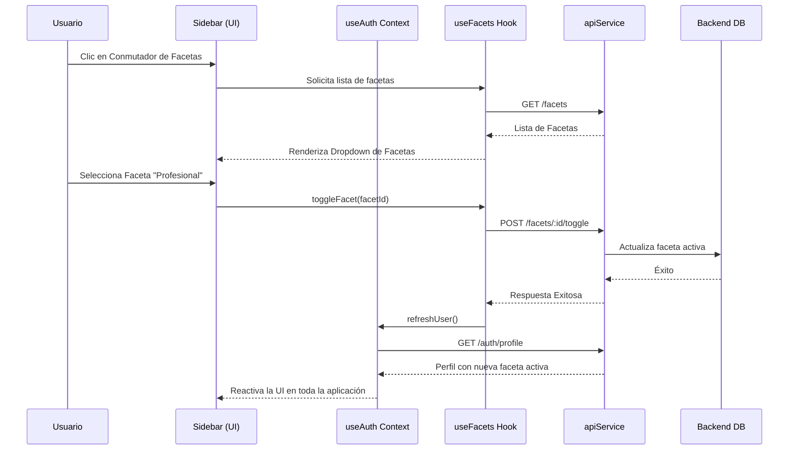

# Spec-Driven Development: Propuesta de Cambio (Proposal)
## Cambio: facets-section-integration

**Estado**: PROPUESTO (PROPOSED)
**Fecha**: 2026-06-01
**Autor**: Antigravity (AI Senior Architect)

---

### 1. Intención del Cambio (Intent)
El objetivo central de esta propuesta es auditar, unificar e integrar de extremo a extremo el **Módulo de Facetas (Multiperfil de Identidad)** en el frontend de Lumora. Aunque parte del panel de gestión individual en el perfil (`/profile`) ya consume la API, el ecosistema de facetas sigue fragmentado y desconectado de elementos clave de la interfaz, como la barra lateral de navegación (Sidebar), las páginas de perfil público de otros usuarios (`/user/[username]`) y el feed de publicaciones global. 

Esta integración garantizará que la identidad dinámica (faceta activa) del usuario gobierne de manera coherente toda su experiencia de navegación, sus privilegios de publicación y la visualización de espacios vivos.

---

### 2. Auditoría del Estado Actual y Elementos Faltantes (Code Audit & Gap Analysis)

Tras auditar detalladamente la base de código del frontend, se identificaron los siguientes problemas estructurales y funcionalidades faltantes:

#### A. Conmutador Rápido de Facetas Estático (Sidebar Switcher Gap)
- **Ubicación**: [`components/layout/sidebar.tsx`](file:///Users/albertovazquez/Documents/lumora-project/lumora-frontend/components/layout/sidebar.tsx#L96-L115)
- **Estado Actual**: Muestra el nombre de la faceta activa mediante la lectura de `user?.facets.find(f => f.isActive)`. Sin embargo, el componente `ChevronDown` y el bloque del usuario son estáticos. Al hacer clic, no ocurre ninguna acción.
- **Lo que falta**: Un selector interactivo rápido (ej. `DropdownMenu` o `Popover` de Radix) inyectado en el Sidebar que liste todas las facetas del usuario, indicando cuál es la activa, y permitiendo cambiar la identidad activa con un solo clic.

#### B. Perfiles Públicos de Usuarios 100% Mockeados (Public Profiles Mockup)
- **Ubicación**: [`app/user/[username]/page.tsx`](file:///Users/albertovazquez/Documents/lumora-project/lumora-frontend/app/user/%5Busername%5D/page.tsx)
- **Estado Actual**: 
  - La carga del perfil público se realiza estáticamente desde el archivo de mocks (`getUserByUsername(username)` de `@/data`).
  - El usuario de sesión (`currentUser`) está mockeado a `mockUsers[0]`, ignorando completamente el hook `useAuth()`.
- **Lo que falta**:
  - Reemplazar las llamadas de datos locales estáticos con llamadas a la API del backend (`apiService.getUserByUsername` o similar).
  - Integrar una pestaña de **"Facetas Públicas"** en el perfil de otros usuarios para explorar las diferentes identidades que tienen permitidas compartir.

#### C. Creación de Contenido Asociado a la Identidad Activa (Facet-Bound Creation)
- **Ubicación**: [`components/posts/create-post.tsx`] (o componentes de creación de feed) e [`components/spaces/create-space-modal.tsx`].
- **Estado Actual**: La creación de publicaciones y espacios no siempre asocia explícitamente el `facetId` de la faceta activa que el usuario tiene seleccionada en ese momento.
- **Lo que falta**: Asegurar que cada payload de publicación (`POST /posts`) e interacción incorpore explícitamente el `facetId` activo en sus cabeceras o cuerpo para mantener el histórico de autoría de forma estricta.

---

### 3. Alcance de la Implementación (Scope)

El alcance se divide en tres fases de desarrollo táctico:

#### **Fase 1: Conmutador Interactivo en la Barra Lateral (Sidebar Facet Switcher)**
- Refactorizar [`components/layout/sidebar.tsx`](file:///Users/albertovazquez/Documents/lumora-project/lumora-frontend/components/layout/sidebar.tsx) para envolver la sección de usuario con un `DropdownMenu`.
- Inyectar el hook `useFacets` y listar las facetas disponibles.
- Implementar la mutación de activación (`toggleFacet`) y forzar la recarga del estado global (`refreshUser`) para actualizar la interfaz.

#### **Fase 2: Conexión de Perfiles Públicos a la API Real**
- Refactorizar [`app/user/[username]/page.tsx`](file:///Users/albertovazquez/Documents/lumora-project/lumora-frontend/app/user/%5Busername%5D/page.tsx) para consultar la información del perfil del backend utilizando el parámetro `username`.
- Mapear y renderizar las facetas públicas del usuario visitado, agregando una pestaña interactiva para explorar sus diferentes roles.

#### **Fase 3: Filtrado y Consistencia de Feeds**
- Asegurar que al cambiar de faceta activa desde cualquier parte de la app, el feed global (`/feed`) y el listado de espacios en el perfil se actualicen reactivamente sin necesidad de recargar la página completa.

---

### 4. Enfoque Técnico y Flujo de Arquitectura (Technical Approach)

---

### 5. Riesgos y Mitigaciones (Risks & Mitigations)

- **Riesgo 1: Desincronización del Contexto Global (Out-of-Sync State)**: Cambiar la faceta activa en la barra lateral podría no invalidar los datos de las páginas activas (como el feed o los espacios abiertos).
  - *Mitigación*: Registrar un callback de evento o forzar una actualización del router mediante `router.refresh()` o invalidación de consultas cuando `refreshUser` finalice.
  
- **Riesgo 2: Rendimiento por Consultas Redundantes**: Si el Sidebar y la página de perfil solicitan la lista de facetas por separado, se duplicarán las peticiones `GET /facets`.
  - *Mitigación*: Centralizar o cachear las facetas en un contexto global si es necesario, o reutilizar las opciones de `useFacets` con `autoFetch: false` cuando el usuario ya disponga de las facetas precargadas en el contexto de autenticación.
