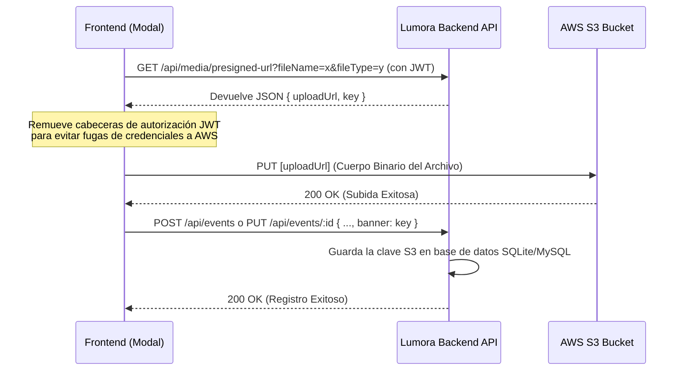

# Spec-Driven Development: Diseño Técnico (Technical Design)
## Cambio: finish-events-scope

Este documento detalla el diseño de arquitectura, estructura de componentes y flujo de datos para completar el alcance del módulo de eventos.

---

### 1. Mapa de Modificación de Archivos (File Modification Map)

Los archivos principales bajo el alcance de esta fase de consolidación de eventos son:
- **`lib/mediaService.ts`** (Frontend Utility):
  - Proporciona `uploadFileToS3` para la subida binaria directa a AWS S3 utilizando URLs firmadas obtenidas del backend.
  - Proporciona `getMediaUrl` para normalizar las claves S3 en URLs HTTPS públicas válidas para renderizar banners de eventos.
- **`app/events/[id]/page.tsx`** (Frontend Page View):
  - Integrar el hook `useEvents` para consumir `deleteEvent`, `attendEvent` y `cancelAttendance`.
  - Reemplazar stubs visuales de conteo por datos dinámicos mapeando `event.attendees`.
  - Asegurar la inyección del normalizador de imágenes `getMediaUrl` en el renderizado del banner y del avatar de speakers.
- **`components/events/complete-create-event-modal.tsx` & `edit-event-modal.tsx`** (Form Modals):
  - Controlar estados de carga (`isUploading`) al subir banners a S3.
  - Mapear las claves devueltas por `uploadFileToS3` a los campos `banner` e `image` del payload enviado al backend.

---

### 2. Flujo de Subida de Imágenes a AWS S3 (S3 Image Upload Flow)

El flujo de carga de medios para los banners de eventos evita la sobrecarga binaria del servidor Lumora y utiliza almacenamiento S3 descentralizado:

#### **Integración en Componentes (Creación y Edición)**:
Al seleccionar un archivo local de banner:
1.  Se activa un estado de carga visual en el formulario.
2.  Se ejecuta `uploadFileToS3(file)` para resolver el flujo binario directo a S3.
3.  La clave única S3 resultante (ej. `media/events/uuid-nombre.png`) se asocia al payload `banner`.
4.  Se procede con la llamada final `createEvent(payload)` o `updateEvent(id, payload)`.

---

### 3. Normalización Horaria y Visual

- **Fechas**: Para prevenir discrepancias horarias entre servidor y cliente, todas las entradas de fecha y hora se capturan en el componente local, se validan mediante la regla `fechaInicio < fechaFin` y se transmiten al backend como strings estandarizados en formato ISO 8601 UTC.
- **Precios e Idioma**:
  - Si `event.price` es `0` o está vacío, se fuerza visualmente el texto `"Gratis"`.
  - Si el evento tiene costo, se utiliza el formateador local `Intl.NumberFormat('es-MX')` y se concatena explícitamente el código de divisa (`MXN` o `USD`) para evitar ambigüedades monetarias.

---

### 4. Criterios de Aceptación Técnica
- [ ] La creación de eventos sube la imagen a S3 y guarda la clave correspondiente.
- [ ] El cambio de asistencia actualiza reactivamente el DOM y el backend sin requerir recarga manual del navegador.
- [ ] Solo el creador del evento visualiza e interactúa con las opciones de edición y eliminación física.
